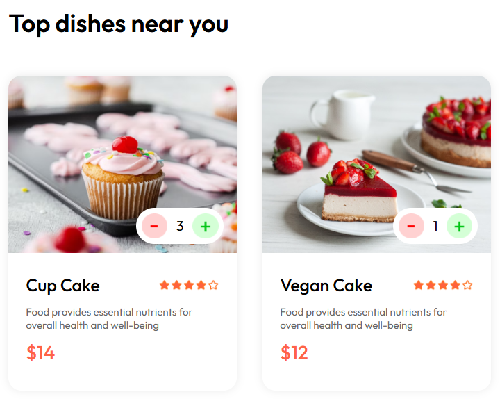
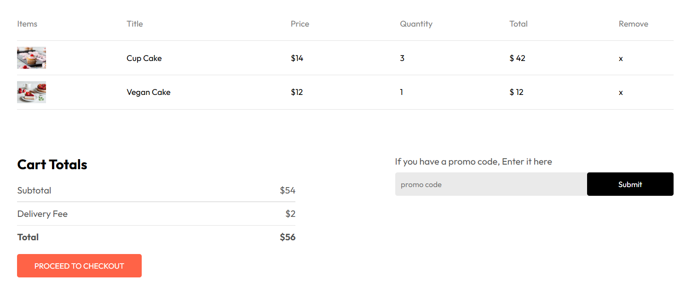
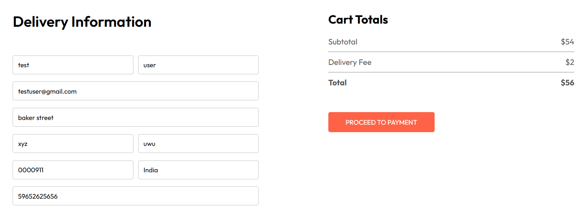
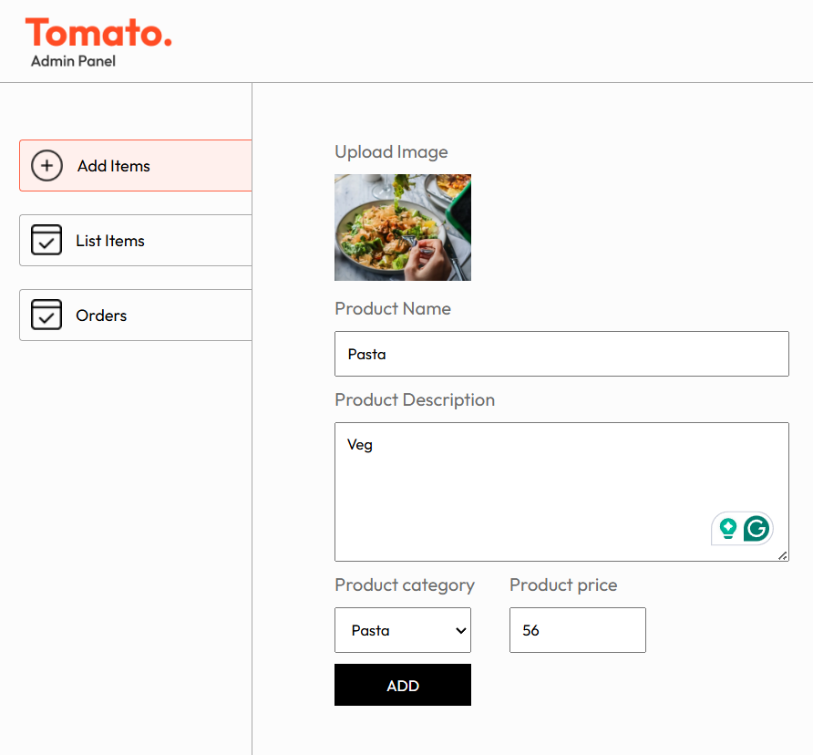
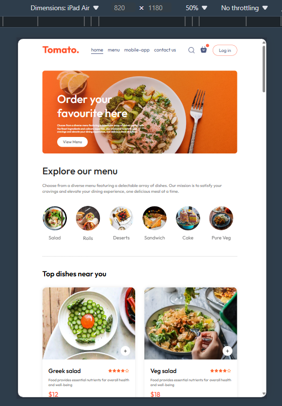

# TomatoFood

React Restaurant Application
This React application is a restaurant platform where users can explore menu items, add items to their cart, place orders, and proceed to checkout with stripe payment gateway for secure transactions. Also developed order status tracking for users and admins. It features a responsive design and utilizes React Router for navigation.

## Deployment
The application is deployed and accessible at [https://tomatofood-frontend.onrender.com/]

## ##Features

Sign-in Page: Users can sign in to access additional features  

Menu Exploration: Users can explore the restaurant's menu items categorized by different food types. 

Filtering: Users can filter menu items based on various criteria such as category, or dietary preferences. 

Adding to Cart: Users can add items to their cart from the menu. 

Cart Management: Users can view their cart, remove items, and proceed to checkout. 

Order Placement: Users can input delivery information and place orders. 

Admin Panel: Enabled administrators to manage food items, including adding, updating, and deleting menu items.

Responsive Design: The application is responsive and suitable for various screen sizes. 

